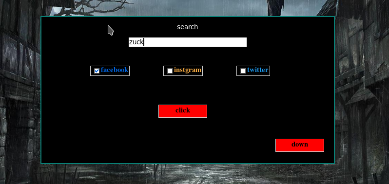

Infoga
===

<h3> Inforamtion gathering tool created by snom v 1.0 :

## 
* Find a person by just name 
* Get info in defrent social media platforms 
* Simple in using
* check about if the account exest

## Installation

```bash
$ pip3 install -r requirements.txt

$ pip3 install beautifulSoup requests tkinter
```
## usage


